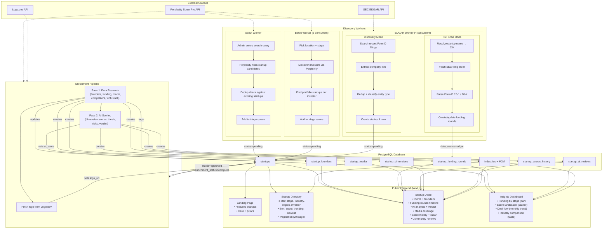

# Acutal — System Overview

## High-Level Architecture

```
┌─────────────────────────────────────────────────────────────────────────────┐
│                           DISCOVERY LAYER                                   │
│                                                                             │
│  ┌──────────────┐   ┌──────────────────┐   ┌────────────────────┐          │
│  │  Scout Chat  │   │  Batch Pipeline  │   │  EDGAR Pipeline    │          │
│  │  (manual)    │   │  (automated)     │   │  (SEC filings)     │          │
│  └──────┬───────┘   └────────┬─────────┘   └─────────┬──────────┘          │
│         │                    │                        │                     │
│         └────────────────────┼────────────────────────┘                     │
│                              ▼                                              │
│                     ┌────────────────┐                                      │
│                     │  Triage Queue  │  (status = pending)                  │
│                     └───────┬────────┘                                      │
│                             ▼                                               │
│                   ┌──────────────────┐                                      │
│                   │  Enrichment      │  (Perplexity Sonar Pro)              │
│                   │  Pipeline        │                                      │
│                   └────────┬─────────┘                                      │
│                            ▼                                                │
│                   status = approved                                         │
└─────────────────────────────────────────────────────────────────────────────┘
                             │
                             ▼
┌─────────────────────────────────────────────────────────────────────────────┐
│                         PUBLIC FRONTEND                                      │
│                                                                             │
│  Landing Page ──── Startup Directory ──── Startup Detail ──── Insights      │
└─────────────────────────────────────────────────────────────────────────────┘
```

---

## Data Model (Entity Relationship)

```mermaid
erDiagram
    startups {
        uuid id PK
        string name
        string slug UK
        text description
        string website_url
        string logo_url
        string tagline
        enum stage "pre_seed|seed|series_a|series_b|series_c|growth|public"
        enum status "pending|approved|rejected|featured"
        enum entity_type "startup|fund|vehicle|unknown"
        enum company_status "active|acquired|ipo|defunct|unknown"
        string location_city
        string location_state
        string location_country
        date founded_date
        string total_funding
        string employee_count
        string revenue_estimate
        string business_model
        text competitors
        text tech_stack
        text key_metrics
        text hiring_signals
        text patents
        string linkedin_url
        string twitter_url
        string crunchbase_url
        float ai_score
        float expert_score
        float user_score
        enum enrichment_status "none|running|complete|failed"
        text enrichment_error
        datetime enriched_at
        string sec_cik
        datetime edgar_last_scanned_at
        uuid template_id FK
    }

    startup_founders {
        uuid id PK
        uuid startup_id FK
        string name
        string title
        string linkedin_url
        boolean is_founder
        text prior_experience
        text education
        int sort_order
    }

    startup_funding_rounds {
        uuid id PK
        uuid startup_id FK
        string round_name
        string amount
        string date
        string lead_investor
        string other_investors
        string pre_money_valuation
        string post_money_valuation
        string data_source "perplexity|edgar"
        int sort_order
    }

    startup_media {
        uuid id PK
        uuid startup_id FK
        string url
        string title
        string source
        enum media_type "article|linkedin_post|video|podcast"
        datetime published_at
    }

    startup_ai_reviews {
        uuid id PK
        uuid startup_id FK UK
        float overall_score
        text investment_thesis
        text key_risks
        text verdict
        jsonb dimension_scores
    }

    startup_reviews {
        uuid id PK
        uuid startup_id FK
        uuid user_id FK
        enum review_type "contributor|community"
        float overall_score
        jsonb dimension_scores
        text comment
        int upvotes
        int downvotes
    }

    review_votes {
        uuid id PK
        uuid review_id FK
        uuid user_id FK
        enum vote_type "up|down"
    }

    startup_dimensions {
        uuid id PK
        uuid startup_id FK
        string dimension_name
        string dimension_slug
        float weight
        int sort_order
    }

    startup_scores_history {
        uuid id PK
        uuid startup_id FK
        enum score_type "ai|expert_aggregate|user_aggregate"
        float score_value
        jsonb dimensions_json
        datetime recorded_at
    }

    industries {
        uuid id PK
        string name UK
        string slug UK
    }

    startup_industries {
        uuid startup_id FK
        uuid industry_id FK
    }

    users {
        uuid id PK
        string email UK
        string name
        string avatar_url
        enum auth_provider "google|linkedin|github|credentials"
        string provider_id
        enum role "user|expert|superadmin"
        string password_hash
        string ecosystem_role
        string region
    }

    expert_profiles {
        uuid id PK
        uuid user_id FK UK
        text bio
        int years_experience
        enum application_status "pending|approved|rejected"
        uuid approved_by FK
    }

    expert_industries {
        uuid expert_id FK
        uuid industry_id FK
    }

    skills {
        uuid id PK
        string name UK
        string slug UK
    }

    expert_skills {
        uuid expert_id FK
        uuid skill_id FK
    }

    startup_assignments {
        uuid id PK
        uuid startup_id FK
        uuid expert_id FK
        uuid assigned_by FK
        enum status "pending|accepted|declined"
    }

    due_diligence_templates {
        uuid id PK
        string name UK
        string slug UK
        text description
        string industry_slug
        string stage
    }

    template_dimensions {
        uuid id PK
        uuid template_id FK
        string dimension_name
        string dimension_slug
        float weight
        int sort_order
    }

    batch_jobs {
        uuid id PK
        enum job_type "initial|refresh"
        enum status "pending|running|paused|completed|failed|cancelled"
        enum current_phase "discovering_investors|finding_startups|enriching|complete"
        json progress_summary
        text error
    }

    batch_job_steps {
        uuid id PK
        uuid job_id FK
        enum step_type "discover_investors|find_startups|add_to_triage|enrich"
        enum status "pending|running|completed|failed|skipped"
        json params
        json result
    }

    edgar_jobs {
        uuid id PK
        string scan_mode "full|discovery"
        string status
        string current_phase
        json progress_summary
        text error
    }

    edgar_job_steps {
        uuid id PK
        uuid job_id FK
        string step_type
        string status
        json params
        json result
    }

    %% Relationships
    startups ||--o{ startup_founders : "has"
    startups ||--o{ startup_funding_rounds : "has"
    startups ||--o{ startup_media : "has"
    startups ||--o| startup_ai_reviews : "has one"
    startups ||--o{ startup_reviews : "receives"
    startups ||--o{ startup_dimensions : "scored on"
    startups ||--o{ startup_scores_history : "tracks"
    startups ||--o{ startup_assignments : "assigned to"
    startups }o--o{ industries : "tagged with"
    startups }o--o| due_diligence_templates : "uses"

    users ||--o{ startup_reviews : "writes"
    users ||--o| expert_profiles : "may have"
    users ||--o{ review_votes : "casts"

    expert_profiles }o--o{ industries : "specializes in"
    expert_profiles }o--o{ skills : "has"
    expert_profiles ||--o{ startup_assignments : "receives"

    startup_reviews ||--o{ review_votes : "has"

    due_diligence_templates ||--o{ template_dimensions : "defines"

    batch_jobs ||--o{ batch_job_steps : "contains"
    edgar_jobs ||--o{ edgar_job_steps : "contains"
```

---

## Agent Workers & Data Flow



---

## What Each Frontend Page Shows

### Landing Page (`/`)
| Data Source | Displayed |
|---|---|
| `startups` (featured, top 6) | logo, name, tagline, description, stage badge, ai_score |

### Startup Directory (`/startups`)
| Data Source | Displayed |
|---|---|
| `startups` (approved/featured, entity_type=startup) | logo, name, tagline, description, stage badge, ai_score |
| `industries` | filter chips |
| `startup_funding_rounds` | investor filter |
| Filters | stage, industry, region (state), investor, search text |
| Sort | ai_score, expert_score, user_score, trending, newest |

### Startup Detail (`/startups/[slug]`)
| Data Source | Displayed |
|---|---|
| `startups` | full profile: name, tagline, description, stage, company status, location, total funding, revenue estimate, business model, employee count, external links |
| `startup_founders` | founder cards: name, title, LinkedIn, experience, education |
| `startup_funding_rounds` | timeline: round name, amount, date, lead investor, other investors, valuations |
| `startup_ai_reviews` | AI analysis: thesis, dimension scores with reasoning, key risks, verdict |
| `startup_media` | media cards: title, source, type icon, published date, link |
| `startup_scores_history` | score timeline chart (ai, expert, user over time) |
| `startup_dimensions` | radar chart of dimension weights |
| `startup_reviews` | community/expert reviews with vote counts |
| `industries` | industry tags |

### Insights Dashboard (`/insights`)
| Data Source | Displayed |
|---|---|
| `startups` (aggregated) | summary stats: total, avg AI score, total funding, industry count, top verdict |
| `startup_ai_reviews` | scatter plot: AI vs expert score per startup |
| `startup_ai_reviews` | histogram: score distribution, verdict breakdown |
| `startup_funding_rounds` | bar chart: funding by stage, recent rounds list |
| `industries` (aggregated) | table: industry name, avg AI score, count, total funding |
| `startups` (by month) | line chart: deal flow trend, recent deals list |
| Filters | stage, industry, country, state, score range, date range |

---

## Worker Lifecycle Summary

| Worker | Trigger | Concurrency | External API | Creates | Updates |
|---|---|---|---|---|---|
| **Scout** | Admin chat query | 1 (interactive) | Perplexity | `startups` (pending) | — |
| **Batch** | Admin starts job | 6 workers | Perplexity | `startups` (pending), then enriches | `batch_jobs`, `batch_job_steps` |
| **EDGAR (full)** | Admin starts job | 4 workers | SEC EDGAR | `startup_funding_rounds` | `startups` (sec_cik, edgar timestamps) |
| **EDGAR (discovery)** | Admin starts job | 4 workers | SEC EDGAR | `startups` (pending), `startup_funding_rounds` | `edgar_jobs`, `edgar_job_steps` |
| **Enrichment** | Auto after discovery, or manual trigger | 1 per startup | Perplexity + Logo.dev | founders, funding rounds, media, AI review, dimensions, score history, industry tags | startup (all fields, scores, status) |
